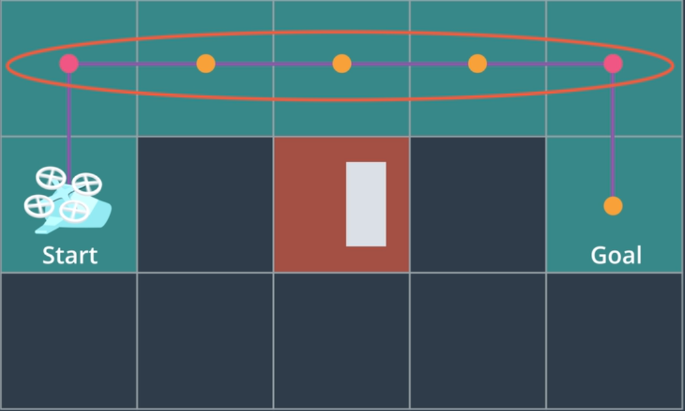
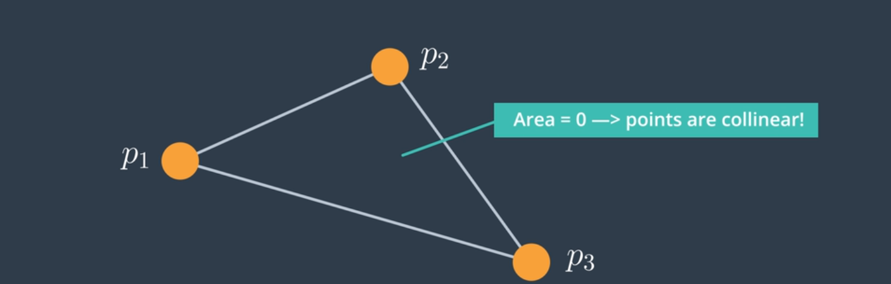
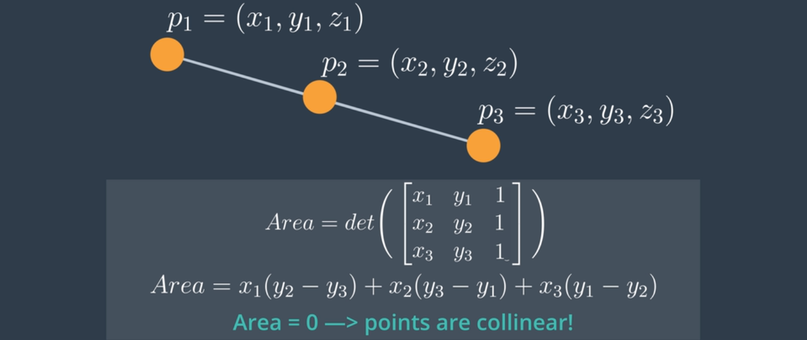

# AAE_Notebook_006_Collinearity
This notebook is to further build upon the concepts presented in previous notebooks; more specifically, we're going to test the points within a given path to see if any are collinear.

### Steps:
  1. Discretize world/environment
  2. Search from start to goal
  3. Test path waypoints for collinearity

Thusfar, throughout the notebooks, we've been working with a 2D quadrotor within a 2D grid of the environment. We've used this grid environment and A* Search to plan a path throughout the grid. However, having the quadcopter move from grid cell to grid cell by way of waypoints isn't exactly the best course of actions.

Over the course of the following few notebooks, we're going to go into methods to further simplify our computed waypoints and, thus, smooth the given trajectory of our AAV.

In this notebook, we're going to explore the concept of waypoint collinearity.

Three points are said to be collinear when their area is more than zero.

Using linear algebra, we take the coordinates of each of the three points and put them into a matrix (see following picture). If the determinant of the matrix is equal to zero, the area of the triangle is equal to zero and the three points are said to be collinear and we can remove the middle point. Essentially, we're extacting the beginning and end points of any sequence that lie along a straight line.

** Note: being as we are working in 2D space, we've set the z-coordinate to 1.

